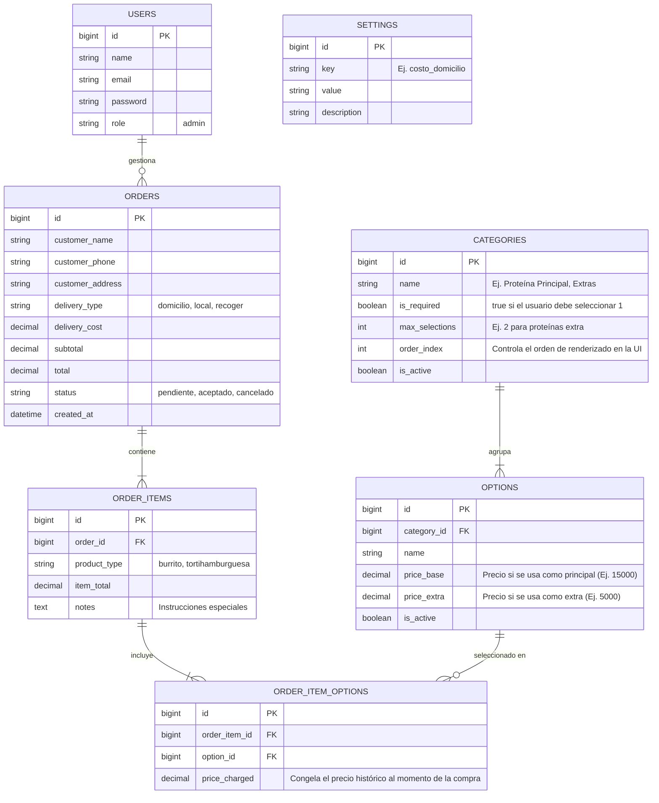

# 🌮 Plan Maestro Técnico: Plataforma Web Deli Burrito

## 1. Contexto y Objetivos del Proyecto
Actuarás como un Desarrollador Full-Stack Senior. Tu objetivo es construir una plataforma web de pedidos a medida y un panel de administración para un restaurante local ("Deli Burrito"). Este sistema reemplazará su proceso manual actual con "Whatsform". 

La complejidad principal radica en un **Constructor de Menú Dinámico** con precios condicionales (el precio base de un producto depende únicamente de la proteína principal seleccionada, con costos adicionales opcionales por proteínas o ingredientes extra).

## 2. Stack Tecnológico y Arquitectura
*   **Patrón de Arquitectura:** **MVC (Modelo-Vista-Controlador)** estricto. El proyecto DEBE adherirse estrictamente a los principios MVC para garantizar una organización de código limpia y separación de responsabilidades. Laravel manejará los Modelos (Datos/Lógica de Negocio) y Controladores (Rutas/Manejo de Peticiones), mientras que React a través de Inertia actuará completamente como la capa de Vista (UI/Presentación).
*   **Backend:** Laravel (v10/11) sobre PHP 8.2+
*   **Frontend:** React 18 integrado vía Inertia.js (SPA controlada por el servidor)
*   **Estilos:** Tailwind CSS + DaisyUI (Enfoque Utility-first, Mobile-first)
*   **Animaciones:** Framer Motion (para micro-interacciones en el frontend del cliente)
*   **Base de Datos:** MySQL 8+ (Eloquent ORM)
*   **Entorno de Despliegue:** Hosting Compartido CPanel (Nota: Node.js/NPM no se pueden ejecutar en el servidor. Todos los assets de Vite/React deben compilarse localmente y desplegarse en el directorio `public` mapeado a `public_html`).

---

## 3. Arquitectura de Base de Datos (ERD)
Implementa el siguiente esquema utilizando Migraciones de Laravel y Modelos Eloquent. Asegúrate de configurar correctamente las restricciones de claves foráneas y las relaciones (HasMany, BelongsTo).

---

## 4. Hoja de Ruta de Desarrollo y Pasos de Implementación

### Fase 1: Configuración del Entorno y Base de Datos
1.  Inicializar un nuevo proyecto Laravel con Inertia.js (versión React).
2.  Instalar Tailwind CSS, DaisyUI y Framer Motion.
3.  Crear migraciones basadas exactamente en el ERD de Mermaid proporcionado arriba.
4.  Crear Modelos Eloquent con propiedades `fillable` y relaciones (ej. `Category::class` hasMany `Option::class`).
5.  Llenar (Seed) la base de datos con un usuario Administrador, configuraciones por defecto (costo_domicilio), y categorías/opciones de muestra simulando el menú real (Proteínas, Vegetales, Salsas, Extras).

### Fase 2: Panel de Administración (Optimizado para Escritorio)
1.  **Autenticación:** Configurar el login para el usuario administrador.
2.  **Constructor de Menú (CRUD - Controladores MVC):** 
    *   Crear Vistas y Controladores para gestionar `CATEGORIES` y `OPTIONS`.
    *   El administrador debe poder alternar `is_active` para ocultar elementos agotados dinámicamente.
    *   El administrador debe poder establecer tanto `price_base` como `price_extra` para cada opción.
3.  **Gestión de Pedidos (Dashboard):**
    *   Construir una cola de pedidos entrantes en tiempo real (o mediante *polling* periódico) representados como tarjetas.
    *   Cada tarjeta debe mostrar detalles del cliente, desglose completo del pedido y total.
    *   Incluir botones de acción: "Aceptar Pedido", "Cancelar Pedido" e "Imprimir Comanda" (activa el diálogo de impresión del navegador con un diseño de formato estandarizado para impresora térmica).
4.  **Analítica:** Vista simple mostrando el conteo diario de pedidos y los ingresos brutos totales.

### Fase 3: Frontend del Cliente (UX Mobile-First)
1.  **Constructor Paso a Paso:** Crear un componente React usando Framer Motion para transiciones suaves entre categorías.
    *   *Regla Lógica:* El primer paso debe ser la Categoría `is_required` (ej. Proteína Principal). El precio del `ORDER_ITEM` se convierte en el `price_base` de esta selección.
    *   *Regla Lógica:* Los pasos siguientes (Extras, Bebidas) suman su `price_extra` al total acumulado.
    *   *Regla UX:* Asegurar que la interfaz permita avanzar automáticamente a la siguiente categoría cuando se toca una opción, pero manteniendo los botones manuales de "Siguiente/Atrás".
2.  **Carrito de Compras y Checkout:**
    *   Almacenar múltiples artículos construidos en el estado de React.
    *   El formulario de checkout debe capturar: Nombre, Teléfono, Dirección y Tipo de Entrega.
    *   Si se selecciona "Domicilio", sumar el `delivery_cost` global de `SETTINGS` al total final.

### Fase 4: Integración con WhatsApp y Envío del Pedido
1.  **API de Envío:** Crear un endpoint en el `OrderController` para recibir el payload del carrito, guardar `ORDERS`, `ORDER_ITEMS` y `ORDER_ITEM_OPTIONS` (recordando guardar una captura del precio actual en `price_charged`).
2.  **Flujo de WhatsApp Manual-Automatizado:** 
    *   NO usar la API Cloud oficial de Meta. 
    *   Cuando el Administrador haga clic en "Aceptar Pedido" en el Dashboard, el frontend debe generar una cadena de URL `wa.me` que contenga un mensaje formateado (usando `%0A` para saltos de línea y `*` para negritas) confirmando que el pedido se está preparando.
    *   Abrir este enlace en una nueva pestaña usando `window.open()`.

### Instrucciones de Ejecución para el Agente de IA
Por favor, confirma la recepción de este documento. Cuando estés listo, comienza ejecutando la **Fase 1** y proporciona el código para las Migraciones y los Modelos Eloquent. Asegura el cumplimiento estricto del patrón MVC. Espera retroalimentación antes de proceder a la Fase 2.